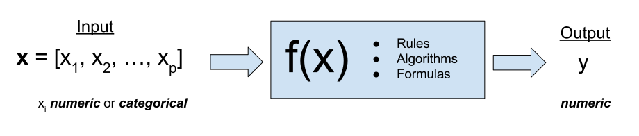

# Regression for Statistical Learning

When using linear models in the past, we often emphasised distributional results, which were useful for creating and performing hypothesis tests. Frequently, when creating a regression model, part of our goal was to **explain** a relationship.

Now, we will ignore much of what we have learned and instead simply use regression as a tool to **predict**. Instead of a model which explains relationships, we seek a model which minimizes errors.




- TODO: linear model is just one form of regression
- TODO: supervised learning
- TODO: input: features (feature vector) predictors (observation)
- TODO: output: response, target, outcome IS NUMERIC

- TODO: don't use ind and dep as names

```{r, message = FALSE, warning = FALSE, echo = FALSE}
library(readr)
Advertising = read_csv("../data/Advertising.csv")
```

TO discuss regression in the context of prediction, we return to the `Advertising` data from the previous chapter.

```{r}
Advertising
```

```{r, fig.height = 4, fig.width = 10, message = FALSE, warning = FALSE}
library(caret)
featurePlot(x = Advertising[ , c("TV", "Radio", "Newspaper")], y = Advertising$Sales)
```

## Test-Train Split

Frequently we will take a dataset of interest and split it in two. One part of the datasets will be used to fit (train) a model, which we will call the **training** data. The remainder of the original data will be used to assess how well the model is predicting, which we will call the **test** data. Test data should *never* be used to train a model.

- TODO: note about train-evaluate-test difference. save for later.


Here we use the `sample()` function to obtain a random sample of the rows of the original data. We then use those row numbers (and remaining row numbers) to split the data accordingly. Notice we used the `set.seed()` function to allow use to reporoduce the same random split each time we perform this analysis.

```{r}
set.seed(9)
train_size = nrow(Advertising)

train_index = sample(1:train_size, size = trunc(0.50 * train_size))
train_data = Advertising[train_index, ]
test_data = Advertising[-train_index, ]
```


## Model Complexity

- TODO: currently only for nested


```{r}
get_complexity = function(model) {
  length(coef(model)) - 1
}
```


## Assesing Model Accuracy

There are many metrics to assess the accuracy of a regression model. Most of these measure in some way the average error that the model makes. The metric that we will be most interested in is the root-mean-square error.


$$
\text{RMSE}(\hat{f}, \text{Data}) = \sqrt{\sum_{i = 1}^{n}\left(y_i - \hat{f}(x_i)\right)^2}
$$

- TODO: note why we prefer "root"
- TODO: note difference between MSE in anova context.
- TODO: only goes down

$$
\hat{y}_i = \hat{f}(x_i)
$$

We will look at two measures that assess how well a model is predicting, the **train RMSE** and the **test RMSE**. (Root-mean-square error.)


$$
\text{RMSE}_{\text{Train}} = \text{RMSE}(\hat{f}, \text{Train Data}) = \sqrt{\sum_{i \in \text{Train}}\left(y_i - \hat{f}(x_i)\right)^2}
$$

- TODO: still only goes down

$$
\text{RMSE}_{\text{Test}} = \text{RMSE}(\hat{f}, \text{Test Data}) = \sqrt{\sum_{i \in \text{Test}}\left(y_i - \hat{f}(x_i)\right)^2}
$$

- TODO: what happens here?


For linear models, training error will not increase as model flexibility increases, thus train RMSE is not useful for determining how well a model predicts. Instead we will only consider the test RMSE.

```{r}
fit_0 = lm(Sales ~ 1, data = train_data)
get_complexity(fit_0)

# train MSE
sqrt(mean((train_data$Sales - predict(fit_0, train_data)) ^ 2))

# test MSE
sqrt(mean((test_data$Sales - predict(fit_0, test_data)) ^ 2)) 
```

The previous two operations obtain the train and test MSE. Since these are operations we are about to use repeatedly, we write a function to make our code easier to write and read.

```{r}
rmse = function(actual, predicted) {
  sqrt(mean((actual - predicted) ^ 2))
}

# train MSE
rmse(actual = train_data$Sales, predicted = predict(fit_0, train_data))
# test MSE
rmse(actual = test_data$Sales, predicted = predict(fit_0, test_data))
```

```{r}
get_rmse = function(model, data, response) {
  rmse(actual = data[, response], 
       predicted = predict(model, data))
}

get_rmse(model = fit_0, data = train_data, response = "Sales") # train MSE
get_rmse(model = fit_0, data = test_data, response = "Sales") # test MSE
```


## Adding Flexibility to Linear Models

Each successive model we fit will be more and more flexible using both interactions and polynomial terms. We will see the training error decrease each time the model is made more flexible. We expect the test error to decrease a number of times, then eventually start going up, as a result of overfitting.

```{r}
fit_1 = lm(Sales ~ ., data = train_data)
get_complexity(fit_1)

get_rmse(model = fit_1, data = train_data, response = "Sales") # train MSE
get_rmse(model = fit_1, data = test_data, response = "Sales") # test MSE
```

```{r}
fit_2 = lm(Sales ~ Radio * Newspaper * TV, data = train_data)
get_complexity(fit_2)

get_rmse(model = fit_2, data = train_data, response = "Sales") # train MSE
get_rmse(model = fit_2, data = test_data, response = "Sales") # test MSE
```

```{r}
fit_3 = lm(Sales ~ Radio * Newspaper * TV + I(TV ^ 2), data = train_data)
get_complexity(fit_3)

get_rmse(model = fit_3, data = train_data, response = "Sales") # train MSE
get_rmse(model = fit_3, data = test_data, response = "Sales") # test MSE
```

```{r}
fit_4 = lm(Sales ~ Radio * Newspaper * TV + 
           I(TV ^ 2) + I(Radio ^ 2) + I(Newspaper ^ 2), data = train_data)
get_complexity(fit_4)

get_rmse(model = fit_4, data = train_data, response = "Sales") # train MSE
get_rmse(model = fit_4, data = test_data, response = "Sales") # test MSE
```

```{r}
fit_5 = lm(Sales ~ Radio * Newspaper * TV +
           I(TV ^ 2) * I(Radio ^ 2) * I(Newspaper ^ 2), data = train_data)
get_complexity(fit_5)

get_rmse(model = fit_5, data = train_data, response = "Sales") # train MSE
get_rmse(model = fit_5, data = test_data, response = "Sales") # test MSE
```

```{r, eval = FALSE}
fit_1 = lm(Sales ~ ., data = train_data)
fit_2 = lm(Sales ~ Radio * Newspaper * TV, data = train_data)
fit_3 = lm(Sales ~ Radio * Newspaper * TV + I(TV ^ 2), data = train_data)
fit_4 = lm(Sales ~ Radio * Newspaper * TV + 
           I(TV ^ 2) + I(Radio ^ 2) + I(Newspaper ^ 2), data = train_data)
fit_5 = lm(Sales ~ Radio * Newspaper * TV +
           I(TV ^ 2) * I(Radio ^ 2) * I(Newspaper ^ 2), data = train_data)
```

```{r}
model_list = list(fit_1, fit_2, fit_3, fit_4, fit_5)
```

```{r}
model_complexity = sapply(model_list, get_complexity)

train_rmse = sapply(model_list, get_rmse, data = train_data, response = "Sales")
test_rmse = sapply(model_list, get_rmse, data = test_data, response = "Sales")

# test_rmse = c(get_rmse(fit_1, test_data, "Sales"),
#               get_rmse(fit_2, test_data, "Sales"),
#               get_rmse(fit_3, test_data, "Sales"),
#               get_rmse(fit_4, test_data, "Sales"),
#               get_rmse(fit_5, test_data, "Sales"))
```


```{r}
plot(model_complexity, train_rmse, type = "b", 
     ylim = c(min(c(train_rmse, test_rmse)) - 0.02, 
              max(c(train_rmse, test_rmse)) + 0.02), 
     col = "dodgerblue", 
     xlab = "Model Size",
     ylab = "RMSE")
lines(model_complexity, test_rmse, type = "b", col = "darkorange")
```


Here we see the results summarized as a table. `fit_1` is the least flexible, and `fit_5` is the most flexible. We see the Train MSE decrease as flexibility increases. We see that the Test MSE is smallest for `fit_3`. (Note this may not be the best model, but it is the best model of the models we have seen in this example.)


| Model   | Train RMSE        | Test RMSE        | Predictors              |
|---------|-------------------|------------------|-------------------------|
| `fit_1` | `r train_rmse[1]` | `r test_rmse[1]` | `r model_complexity[1]` |
| `fit_2` | `r train_rmse[2]` | `r test_rmse[2]` | `r model_complexity[2]` |
| `fit_3` | `r train_rmse[3]` | `r test_rmse[3]` | `r model_complexity[3]` |
| `fit_4` | `r train_rmse[4]` | `r test_rmse[4]` | `r model_complexity[4]` |
| `fit_5` | `r train_rmse[5]` | `r test_rmse[5]` | `r model_complexity[5]` |

To summarize:

- **Underfitting:** *High* Train MSE, *High* Test MSE. Seen in `fit_1`.
- **Overfitting:** *Low* Train MSE, *High* Test MSE. Seen in `fit_5`.

- TODO: note about "echo"

- TODO: garunatee train
- TODO: note for test
- TODO: note about which is higher

- TODO: dependence on seed. will fix later

- TODO: relativity

- TODO: which model we would choose
- TODO: "generalize"

- TODO: exp vs pred, only look at test RMSE to decide. no hyp testing!
- TODO: collinearity, didn't even consider!
- TODO: assumptions? who cares? diagnostics! why bother? 
- TODO: fix relative reference
